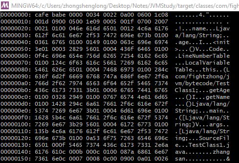
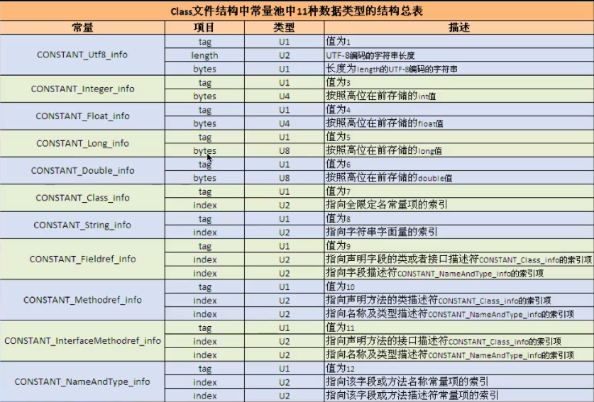
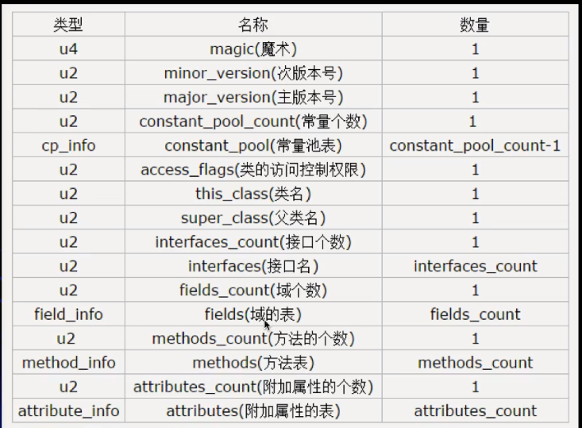

javap -c 全类名
javap -verbose 全类名
vim class文件后输入:%!xxd, 表示用16进制来显示字节码文件

下载软件

使用该命令分析一个字节码文件时, 将会分析该字节码文件的魔数、版本号、常量池、类信息、类的构造方法、
类中的方法信息、类变量与成员变量等信息

魔数: 所有的.class字节码文件的前4个字节都是魔数, 魔数值固定为CA FE BA BE

魔数之后的4个字节为版本信息, 前两个字节表示minor version(次版本号), 后两个字节表示major version
(主版本号), 例如版本号为00 00 00 34, 换算成十进制是52, 得出该文件的版本号为1.8.0(即Java版本)

常量池(constant pool): 紧接着主版本号之后的就是常量池入口, 一个Java类中定义的很多信息都是由常量池
来维护和描述的, 可以将常量池看作是Class文件的资源仓库, 比如Java类中定义的方法与变量信息, 都是存储
在常量池中。常量池中主要存储了两类常量: 字面量常量与符号引用。字面量如文本字符串, Java中声明为final
的常量等, 而符号引用如类和接口的全局限定名, 字段的名称和描述符, 方法的名称和描述符等

常量池的总体结构: Java类所对应的常量池主要由常量池数量与常量池数组(常量表)两部分组成。常量池数量紧跟
在主版本号后面, 占据两个字节, 表示常量池中常量的个数, 常量池数组就是真正的常量值, 则紧跟在常量池数量
之后, 常量池数组与一般的数组不同的是, 常量池数组中的不同的元素的类型、结构都是不同的, 长度当然也就
不同, 但是常量池数组中的每一个元素都以一个U1类型(下面会说)的值开始(占一个字节), U1类型的值的不同对
应着不同的常量类型, 然后找到常量类型就能够分析该常量的结构了(下面会具体说明, 如果看不懂可以先看常量
池数组值分析后再回过头来看这段描述), 注意: 常量池数组中的元素个数 = 常量池数(二进制数据中表示的数)
减去1(因为0暂时不使用), 比如我们分析二进制数据中发现常量池数对应的二进制转为10进制后为23, 那么常量池
中元素的个数是22个, 之所以少一个的原因是某些常量池索引值的数据再特定情况下需要表达[不引用任何一个
常量池]的含义, 根本原因是, 索引为0也是一个常量(保留常量), 只不过它不位于常量表(常量池数组)中, 这个
常量就对应null; 所以, 常量池的索引从1而非0开始


## 字节码分析
- 源Java代码
  ```java
  package com.fightzhong.jvm.bytecode;

  public class TestClass1 {
    private String name = "zhangsan";
    private int age = 111;

    public int getAge () {
      return age;
    }

    public String getName () {
      return name;
    }

    public static void main (String[] args) {

    }
  }
  ```

- 执行javap -verbose com.fightzhong.fightzhong.jvm.bytecode获取字节码数据(显示一部分, 下面称为数据A)
  ```
    Last modified Jul 29, 2019; size 707 bytes
    MD5 checksum 54a3e5dde0279ec5f2813f05cdc6d36a
    Compiled from "TestClass1.java"
  public class com.fightzhong.jvm.bytecode.TestClass1
    minor version: 0
    major version: 52
    flags: ACC_PUBLIC, ACC_SUPER
  Constant pool:
    #1 = Methodref          #6.#28         // java/lang/Object."<init>":()V
    #2 = String             #29            // zhangsan
    #3 = Fieldref           #5.#30         // com/fightzhong/jvm/bytecode/TestClass1.name:Ljava/lang/String;
    #4 = Fieldref           #5.#31         // com/fightzhong/jvm/bytecode/TestClass1.age:I
    #5 = Class              #32            // com/fightzhong/jvm/bytecode/TestClass1
    #6 = Class              #33            // java/lang/Object
    #7 = Utf8               name
    #8 = Utf8               Ljava/lang/String;
    #9 = Utf8               age
    #10 = Utf8               I
    #11 = Utf8               <init>
    #12 = Utf8               ()V
    #13 = Utf8               Code
    #14 = Utf8               LineNumberTable
    #15 = Utf8               LocalVariableTable
    #16 = Utf8               this
    #17 = Utf8               Lcom/fightzhong/jvm/bytecode/TestClass1;
    #18 = Utf8               getAge
    #19 = Utf8               ()I
    #20 = Utf8               getName
    #21 = Utf8               ()Ljava/lang/String;
    #22 = Utf8               main
    #23 = Utf8               ([Ljava/lang/String;)V
    #24 = Utf8               args
    #25 = Utf8               [Ljava/lang/String;
    #26 = Utf8               SourceFile
    #27 = Utf8               TestClass1.java
    #28 = NameAndType        #11:#12        // "<init>":()V
    #29 = Utf8               zhangsan
    #30 = NameAndType        #7:#8          // name:Ljava/lang/String;
    #31 = NameAndType        #9:#10         // age:I
    #32 = Utf8               com/fightzhong/jvm/bytecode/TestClass1
    #33 = Utf8               java/lang/Object
  ```

- 我利用电脑上git自带的bash命令行来查看16进制显示的字节码数据 vim 文件后输入:%!xxd

  

> 用16进制来表示二进制数据, 就是说对于这个图片上的数据, 每两个数代表一个字节(八位可以用两个16进制数表示)

- 魔数分析
  ```
  cafe babe: 占四个字节, 魔数, 用于标识这是一个class文件, 每个class文件都以这个数开始, 就像图片
             数据的二进制数据也会以一个魔数开头一样, 标识一个文件的类型
  ```  

- 版本号分析(表示编译该Java文件成为一个class文件的Java版本)
  ```
  0000 0034: 占4个字节, 前两个字节表示次版本号, 后两个字节表示主版本号, 转为10进制为0和52, 即数据
             A中表示的表示的minor version: 0, major version: 52, 编译该文件的Java版本为1.8.0,
             1.8为主版本号, 0为次版本号
  ```
- 常量池数量
  ```
  0022: 转为10进制为34, 减去1为33, 所以常量池数组中元素个数为33个, 即数据A中constant pool只显示了
        33个元素
  ```

- 在对常量池数组即常量池值进行分析之前, 我们先了解下各个描述符代表的含义
  ```
  <1> 对于基本数据类型, 每一个类型都用大写的字母表示, 如byte => B, short => S, char => C, 
      int => I, double => D, long => J, float => F,  boolean => Z, void => V
  <2> 对于对象类型来说, 用L加上对象的全限定名称来表示, 例如String表示Ljava/lang/String 
  <3> 对于数组类型来说, 每一个维度使用一个前置的[来表示, 如int[]表示为[I, String[][]表示为
      [[Ljava/lang/String
  <4> 对于方法来说, 按照参数的顺序来描述, 将参数描述放在一对括号()中并在参数结尾用分号结束, 如方法
      String getAddressByNameAndAge(String name, int age)则被描述为:
      (Ljava/lang/String, I;)Ljava/lang/String
  ```


- 常量池数组分析(分析时需要对照数据A和下面的常量池结构图片以及二进制数据来进行分析)

  

  ```
  只分析第一个常量元素: U1类型表示1个字节, U2表示2个字节, Ux表示x个字节

  <1> U1类型(表示占据一个字节)的字段开头, 占一个字节, 二进制显示为0a, 值为10, 即U1 = 10
  <2> 在元素结构表中查找U1为10的, 即为Methodref常量, 说明第一个常量元素是用来描述一个方法的信息,
      根据元素结构表, 描述一个方法还需要两个U2类型index来描述, 第一个U2类型的值表示[指向声明方法的
      类描述符], 即表示该方法是由那个类声明的, 第二个U2类型的值表示[指向名称及类型描述符], 即表示该 
      方法的参数类型, 返回值类型, U1字段后面的4个字节为对该方法的一个具体描述
  <3> 查看二进制数据, 第一个U2类型(两个字节)为00 06, 转为10进制为6, 第二个U2类型为00 1c, 转为10
      进制为28, 表示该方法的描述由常量元素第6个和第28个来共同表示
      #6 = Class              #33            // java/lang/Object
      #33 = Utf8               java/lang/Object

      #28 = NameAndType        #11:#12        // "<init>":()V
      #11 = Utf8               <init>
      #12 = Utf8               ()V


  <4> 第6个常量引用了第33个常量值, 即java/lang/object, 所以第6个常量的值为注释符号//后面的字符串,
      第28个常量引用了第11和12个常量, 第11个常量为<init>, 表示为构造方法, 第12个表示为()V, 即空参
      方法, 返回值为void

  注意: 上面的分析描述了二进制class文件数据是如何与javap -verbose反编译后的数据进行映射的     
  ```

## Java字节码结构
```
U4                   Magic(魔数);
U2                   minor_version(次版本号)
U2                   major_version(主版本号)
U2                   constant_pool_count(常量池中元素的个数)
cp_info              constant_pool(常量池)
U2                   access_flags;(类访问控制标志)
U2                   this_class(类名, index)
U2                   super_class(父类名, index)
U2                   interface_count(实现的接口个数)
U2                   interfaces(接口名,可以为多个, index)
U2                   fields_count(域的个数)
fileld_info          fields(域的表)
U2                   methods_count(方法的个数)
method_info          methods(方法表)
u2                   attributes_count(额外的属性的个数)
attribute_info       attributes(额外的属性表)
```



## Access Flag访问控制权限
```
ACC_PUBLIC              0X0001: 是否为public类型
ACC_PRIVATE             0X0002: 是否被声明为final
ACC_STATIC              0X0008: 是否是static
ACC_SUPER               0X0020: 是否允许使用invokespecial字节码指令的新语义
ACC_INTERFACE           0X0200: 标志这是一个接口
ACC_ABSTRACT            0X0400: 是否为Abstract类型
ACC_ANNOTATION          0X2000: 标志这是一个注解
ACC_ENUM                0X4000: 标志这是一个枚举
ACC_SYNTHETIC	          0x1000:	标志这个类并非由用户代码产生
```


## 字段表(属性表)
```
描述: 用于描述类和接口中声明的变量, 这里的字段包含了类级别变量以及实例变量, 但是不包含方法内部声明
      的局部变量
 
结构:
  U2                    access_flags
  U2                    name_index
  U2                    descriptor_index
  U2                    attributes_count
  Attribute_info        attributes
```


Class字节码中有两种数据类型
  字节数据直接量: 这是基本数据类型, 共细分为U1, U2, U4, U8四种, 分别代表连续的1个字节、2个字节
                  4个字节、8个字节组成的整体数据
  表(数组): 表是由多个基本数据或其它表, 按照既定顺序组成的大的数据集合。表是有结构的, 它的结构体
            现在: 组成的表的成分所在的位置和顺序都是已经严格定义好的               


