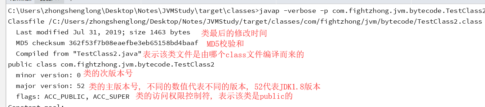
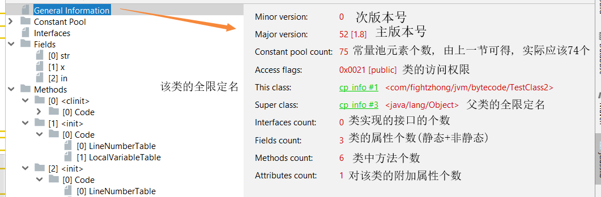
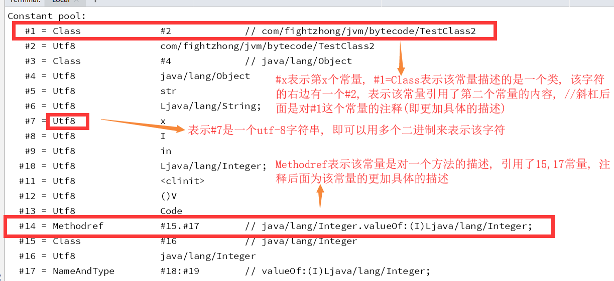
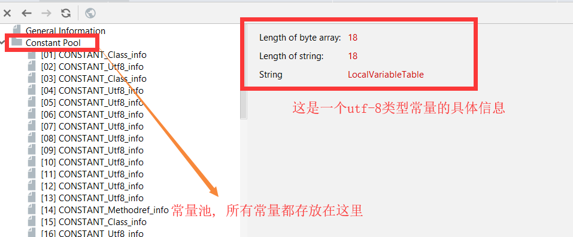
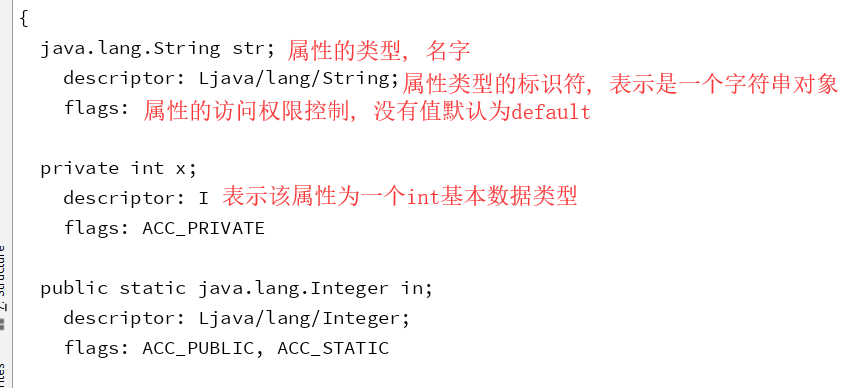
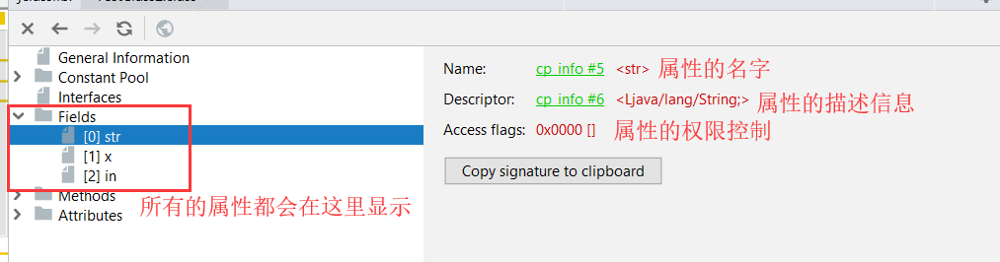
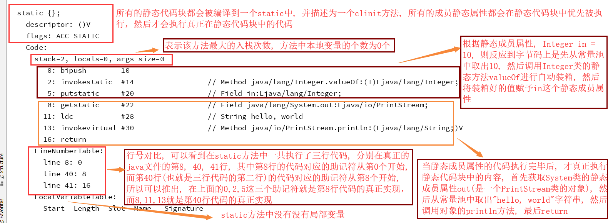
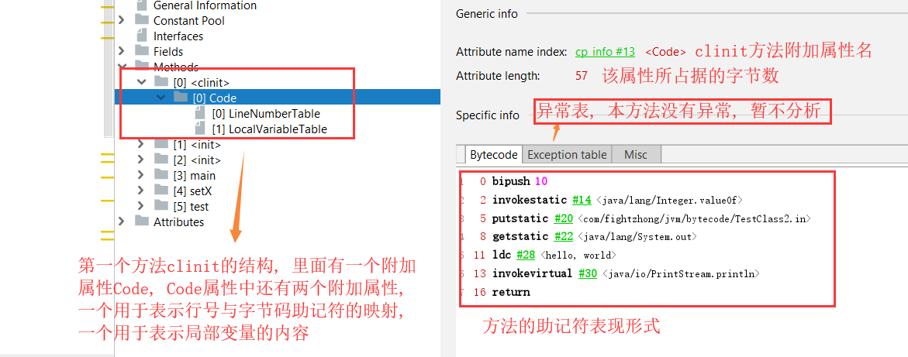
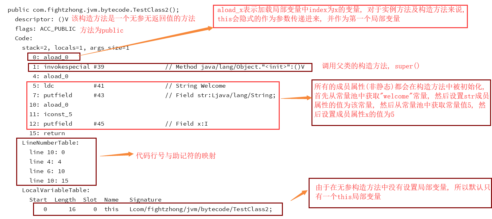
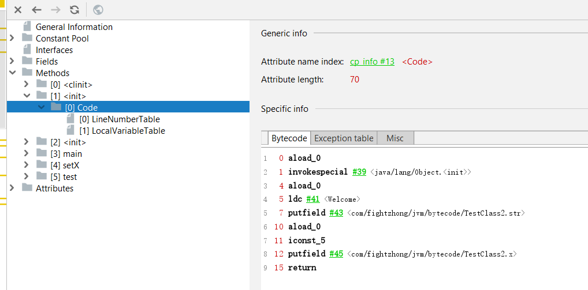

> 在前面的部分我们对字节码以及字节码中各个表的结构进行了一下概括, 这一节我们通过一个较为复杂的类进行
字节码的分析, 分析的描述将按照字节码文件的结构顺序分析(见上一节)

## 类源代码
```java
public class TestClass2 {
	String str = "Welcome";

	private int x = 5;

	public static Integer in = 10;
	
	public TestClass2 () {}
	
	public TestClass2 (int a) {
		System.out.println( a );
	}
	
	public static void main (String[] args) {
		TestClass2 testClass2 = new TestClass2();

		testClass2.setX(8);

		in = 20;

		if (in == 20) {
			int aaaa = 10;
		}
		int bbbb = 20;
	}

	public synchronized void setX (int x) {
		this.x = x;
	}
	
	private void test (String str) {
		synchronized (str) {
			System.out.println( "hello, world" );
		}
	}
	
	static {
		System.out.println( "hello, world" );
	}
}
```

## 1、类的基本信息
  - 1.1、反编译指令的显示结果

  

  - 1.2、jclasslib插件的显示结果

  

## 2、常量池
  > 常量池元素的二进制结构分析在上一节已经分析了, 这里就对反编译后的结果进行简短的描述

  - 1.1、反编译指令的显示结果
  

  - 1.2、jclasslib插件的显示结果
  

## 属性描述
  - 1.1、反编译指令的显示结果
  

  - 1.2、jclasslib插件的显示结果
  

## 方法一: clinit
  - 1.1、反编译指令的显示结果
  

  - 1.2、jclasslib插件的显示结果
  

## 方法二和方法三: init(构造方法)
  - 1.1、反编译指令的显示结果
  

  - 1.2、jclasslib插件的显示结果
  

