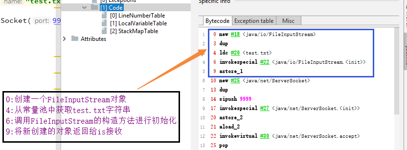
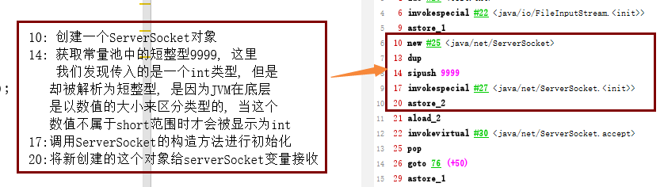
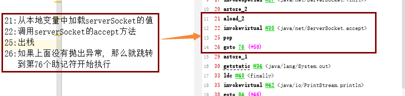
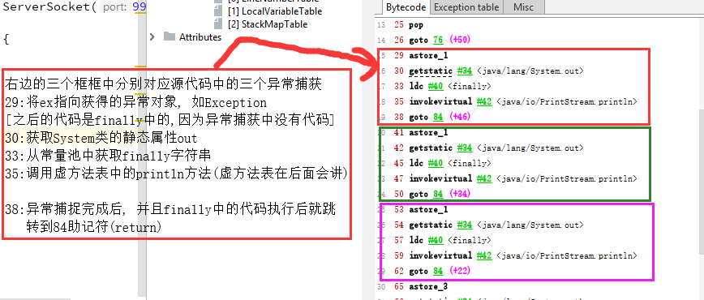
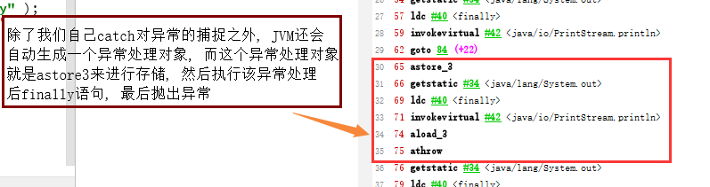
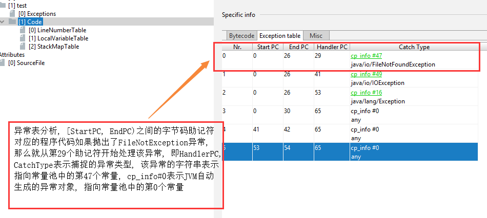

## 源代码
```java
public class TestClass3 {
	public void test () throws Exception {
		try {
			InputStream is = new FileInputStream( "test.txt" );

			ServerSocket serverSocket = new ServerSocket(9999);
			serverSocket.accept();
		} catch (FileNotFoundException ex) {

		} catch (IOException ex) {

		} catch (Exception ex) {

		} finally {
			System.out.println( "finally" );
		}
	}
}
```

> **由于大部分的内容在前两节都已经分析过了, 这一节主要分析异常表, 而在代码中主要在test方法中进行**
> **了异常的捕捉, 所以我们下面主要针对test方法的字节码进行分析**

## 分析

- InputStream is = new FileInputStream( "test.txt" );



- ServerSocket serverSocket = new ServerSocket(9999);



- serverSocket.accept();



- catch代码块



- JVM生成的异常对象



- 异常表分析



## 小结
```
在程序代码中, 我们认为Exception会处理所有的异常, 但是对于JVM来说不是这么认为的, catch type为0则表
示JVM处理所有的异常

利用异常表来对异常进行处理时, 如果存在finally语句块, JVM会将finally语句块的字节码(或者助记符表示)
拼接到每一个catch块后面, 换句话说, 程序中一个try语句存在多少个catch块, 就会在每一个catch块后面重
复多少个finally语句块的字节码 
```

