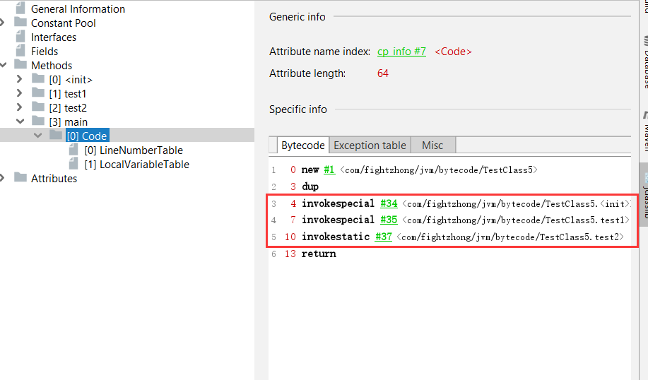
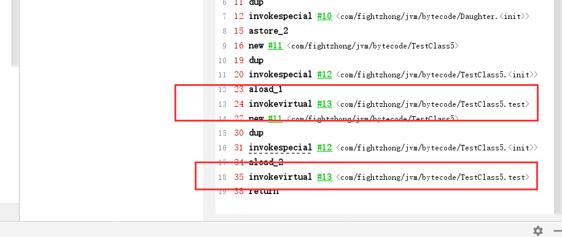
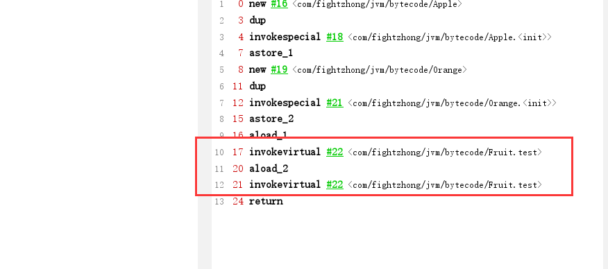

## 方法的调用之非虚方法
- 源代码
  ```java
  下面以一个常规的方法调用的例子来引入

  public class TestClass5 {
    private void test1 () {
      System.out.println( "test..." );
    }

    public static void test2 () {
      System.out.println( "test2..." );
    }
    
    public static void main (String[] args) {
      new TestClass5().test1();
      TestClass5.test2();
    }
  }
  ```
- jclasslib反编译字节码显示


 
- 分析
  ```
  非虚方法:
    <1> 静态方法
    <2> 父类方法
    <3> 构造方法
    <4> 私有方法
  以上四类都是非虚方法, 对于非虚方法来说, 在类加载阶段就可以将方法的符号引用(如: 
  com/fightzhong/jvm/bytecode/TestClass5.<init>)转换为内存中的直接引用, 在编译时确定了调用者, 
  同时非虚方法的符号引用转为直接引用也叫静态解析(在类加载时就能确定, 从而解析完成) 

  如上面的代码和图所描述的, private修饰的test1, static方法test2以及TestClass5的构造方法, 都是非虚
  方法, 用助记符invokespecial, invokestatic来表示
  ```

## 方法的调用之虚方法(invokevirtual)
> 虚方法又分为两种, 静态分派和动态分派

### 静态分派(典型代表为重载)
- 源代码
  ```java
  // 简单的继承体系
  class Father {

  }

  class Son extends Father {

  }

  class Daughter extends Father {

  }

  // 方法重载
  public class TestClass5 {
    public void test (Father f) {
      System.out.println( "father..." );
    }
    
    public void test (Son s) {
      System.out.println( "son..." );
    }

    public void test (Daughter d) {
      System.out.println( "daugher..." );
    }

    public static void main (String[] args) {
      Father son = new Son();
      Father dau = new Daughter();

      new TestClass5().test( son );
      new TestClass5().test( dau );
    }
  }  
  ```
- 分析
  ```
  由上面的代码我们可以看到, 首先是3个类实现了简单的继承关系, 然后再TestClass5这个类中实现了test方
  法的三次重载, 三次重载的不同点是参数类型的不同, 然后当我们调用下面的main方法的时候, 会发现两个输
  出都是"father..."

  静态分派: 真正决定调用哪个方法是取决于参数的静态类型, 对于Father son = new Son()这个来说, 
            Father就是son变量的静态类型,而Son才是son变量的实际类型, 对于重载的调用来说是属于静态
            分派的
  由下面的jclasslib反编译的字节码信息可以看到, 对于两次的test方法的调用使用的都是invokevirtual助
  记符, 但是这个虚方法的调用是静态分派的, 之后还有一种情况是动态分派的, 对于静态分派来说, 决定一个
  方法的调用是通过参数的静态类型, 而动态分派是根据方法调用的实际类型来进行判断      
  ```
- jclasslib反编译



### 动态分派(典型代表为重写)
- 源代码
  ```java
  // 简单的继承关系重写方法
  class Fruit {
    public void test () {
      System.out.println( "fruit..." );
    }
  }

  class Apple extends Fruit {
    @Override
    public void test () {
      System.out.println( "apple..." );
    }
  }

  class Orange extends Fruit {
    @Override
    public void test () {
      System.out.println( "orange..." );
    }
  }

  // 调用
  public class TestClass6 {
    public static void main (String[] args) {
      Fruit apple = new Apple();
      Fruit orange = new Orange();

      apple.test();
      orange.test();
    }
  }
  ```

- 分析
  ```
  根据上面的代码, 仅仅只是一个简单的继承关系并重写了test方法, 然后在main方法中进行了多态的创建, 之
  后调用了test方法

  动态分派: 通过test方法的调用结果, 我们发现了一个输出了apple, 一个输出了orange, 而通过反编译的
           结果可以看到, 调用test方法用的都是invokevirtual助记符, 这次的invokevirtual和静态分派
           的调用是不一样的, 这里对test方法的调用是根据实际类型来判断执行哪个方法则叫动态分派
           
  动态分派方法调用的流程:
      <1> 找到操作数栈中栈顶元素所指向的实际类型, 如上面中apple的实际类型是Apple
      <2> 如果在Apple中找到了参数和返回值类型一致的test方法, 那么就进行权限校验, 校验通过则直接调
          用该方法, 校验不通过则报错
      <3> 如果第二步中没有找到对应的test方法, 那么就查找Apple的父类, 并重新进行第二步操作, 还没找
          到则继续沿着父类查找, 直到找到为止, 找不到则报错

  根据下面的jclasslib可以看到, 虽然真正调用的是Apple和Orange类中的test方法, 但是在字节码的层次上
  显示调用的Fruit类的test方法, 即在运行期根据实际类型来判断调用方法的版本        
  ```
- jclasslib反编译



## 总结
```
变量的静态类型是不会发生变化的, 而变量的实际类型则是可以发生变化的(多态的一种体现), 实际类型是在运
行期方可确定的, 方法重载是静态的, 是编译期行为; 方法重写是动态的, 是运行期行为

符号引用&直接引用: 有些符号引用是在类加载阶段或是第一次使用时就会转换为直接引用, 这种转换叫做静态解
                  析;另一些符号引用则是在每次运行期转换为直接引用, 这种转换叫做动态链接, 这体现为
                  Java的多态性

调用方法的五种助记符:
  invokeinterface: 调用接口中的方法, 实际是在运行期间决定的, 决定到底调用实现改接口的哪个对象的特
                  定方法。
  invokestatic: 调用静态方法。
  invokespecial: 调用自己的私有方法、构造方法(<init>)以及父类的方法
  invokevirtual: 调用虚方法, 运行期动态查找的过程
  invokedynamic: 动态调用方法  

针对于方法调用动态分派的过程, 虚拟机会在类的方法区建立一个虚方法表的数据结构(virtual method table vtable)
针对于invokeinterface指令来说, 虚拟机会建立一个叫接口方法表的数据结构(interface method table itable)

对于这个方法区的虚方法表来说, 里面存放了方法的入口, 对于继承关系来说, 子类如果重写了父类的某个方法,
那么对于子类的方法区中该方法的入口为子类, 而如果没有重写, 则入口为父类
```
