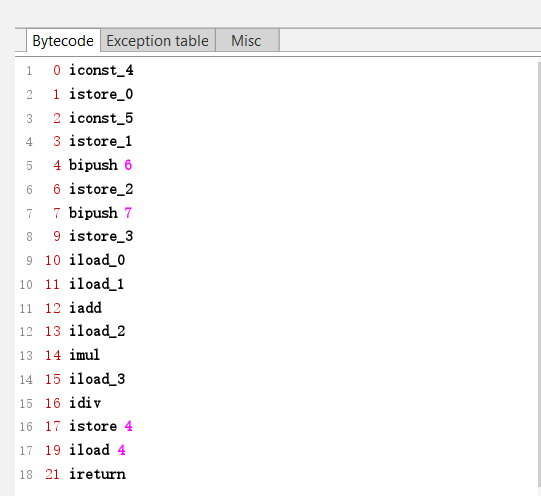

> 在讲解关于栈的指令集相关概念之前我们先以对一个例子进行一下分析

- 源代码
  ```java
  // 一个很简单的算术运算
  public class TestClass8 {
    public static int test () {
      int a = 4;
      int b = 5;
      int c = 6;
      int d = 7;

      int result = ( a + b ) * c / d;
      return result;
    }

    public static void main (String[] args) {
      TestClass8.test();
    }
  }
  ```
- jclasslib

  

- 分析
  ```
  字节码指令集分析:
  iconst_4: 将数字4推送到栈顶
  istore_0: 将局部变量(local variable)中索引为0的变量的值设为4
  iconst_5: 将数字5推送到栈顶
  istore_1: 将局部变量(local variable)中索引为1的变量的值设为5
  bipush 6: 将数字6推送到栈顶
  istore_2: 将局部变量(local variable)中索引为2的变量的值设为6
  bipush 7: 将数字7推送到栈顶
  istore_3: 将局部变量(local variable)中索引为3的变量的值设为7
  iload_0: 从局部变量中加载索引为0的变量的值并推送到栈顶
  iload_1: 从局部变量中加载索引为1的变量的值并推送到栈顶
  iadd: 从栈顶弹出两个元素执行相加操作并将结果放入栈顶
  iload_2: 从局部变量中加载索引为2的变量的值并推送到栈顶
  imul: 从栈顶弹出两个元素执行相乘操作并将结果放入栈顶
  iload_3: 从局部变量中加载索引为3的变量的值并推送到栈顶
  idiv: 从栈顶弹出两个元素执行相除操作并将结果放入栈顶
  istore 4: 将栈顶的元素存储到局部变量中索引为4的变量中
  iload 4: 从局部变量中加载索引为4的变量的值并推送到栈顶
  ireturn: 返回一个int类型的值

  根据Java虚拟机规范: istore_0等价于istore 0指令, 为了更加方便操作指令, JVM提供了几个简便的指令,
                     如istore_0, 同时iconst_3 等价于bipush 3

  由上述的指令集可见, Java是通过栈的指令集来对代码进行执行的                   
  ```

- 概念总结
  ```
  栈帧: 是一种用于帮助虚拟机指向方法调用与方法指向的数据结构, 封装了方法的局部变量表、方法的返回地
        址、动态链接信息以及操作数栈等信息

  现代JVM在执行Java代码的时候, 通常都会将解释执行和编译执行二者结合起来进行        

  解释执行: 通过解释器来读取字节码, 遇到相应的指令去执行该指令
  编译执行: 通过即时编译器(Just In Time JIT)将字节码转换为本地机器码来执行, 现代JVM会根据代码热点
           来生成相应的本地机器码 

  基于栈的指令集与基于寄存器的指令集之间的关系:
    1、JVM执行指令时所采取的方式是基于栈的指令集
    2、基于栈的指令集主要的操作有入栈和出栈两种
    3、基于栈的指令集的优势在于它可以在不同平台之间移植, 而基于寄存器的指令集是与硬件紧密相关的, 
       无法做到可移植
    4、基于栈的指令集的缺点在于完成相同的操作, 指令集数量通常比基于寄存器的指令集数量更多;基于栈的
       指令集是在内存中完成操作的, 而基于寄存器的指令集是直接由CPU来执行的, 它是在高速缓冲区进行执
       行的, 速度要快很多, 虽然虚拟机可以采用一些优化收端, 但总体来说, 基于栈的指令集的执行速度要
       慢一些
  ```
