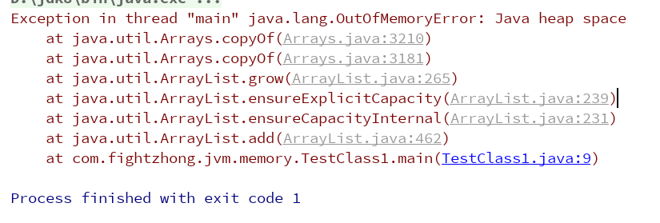
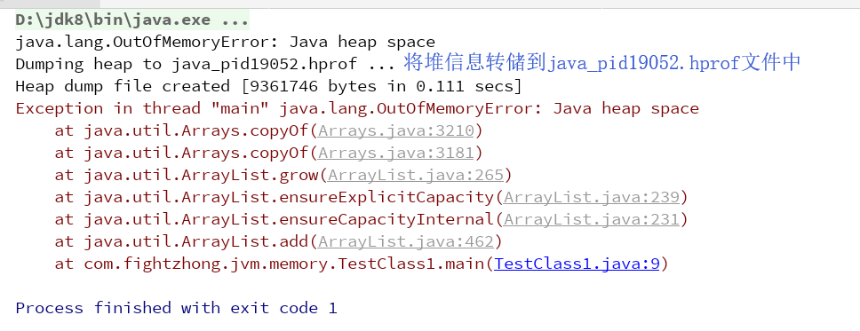
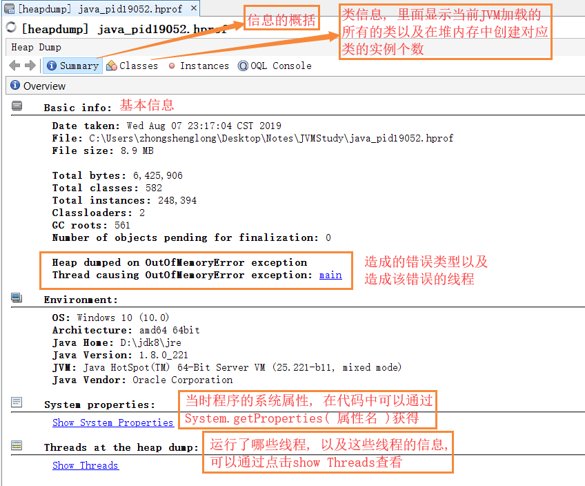
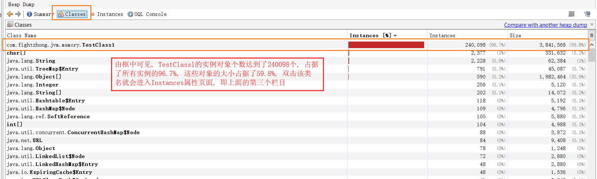
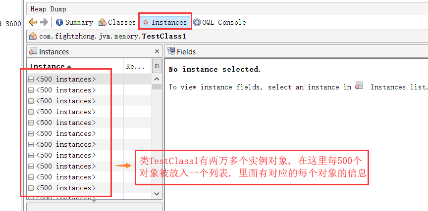
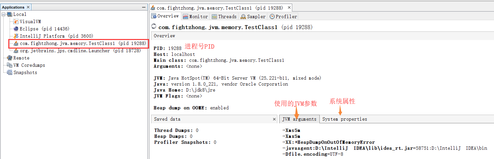
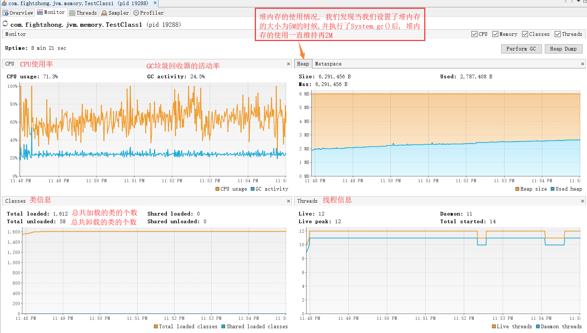
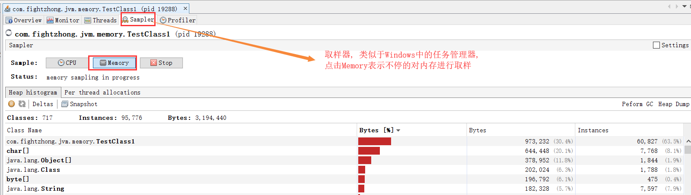

## 堆内存溢出案例分析( OutOfMemoryError )
- 源代码
	```java
	public class TestClass1 {
		public static void main (String[] args) {
			ArrayList<TestClass1> list = new ArrayList<>();
			while ( true ) {
				list.add( new TestClass1() );
			}
		}
	}
	```
- 分析
	```
	由代码可得, 通过一个死循环我们不停的往list中添加TestClass1类对象, 从而使得堆中的对象个数不停的
	增加, 从而会造成堆内存溢出错误, 如下图: 
	```

		

- JVM参数进一步测试堆内存溢出错误
	```
	为了能够更快的造成堆内存溢出, 并且将堆内存的溢出错误发生的现场环境保存下来, 我们可以添加三个JVM
	参数[ -Xms5m -Xmx5m -XX:+HeapDumpOnOutOfMemoryError ], 参数的含义是设置虚拟机堆内存的最小值
	为5M, 最大值为5M, 即不存在堆内存的变化, 固定为5M, 如下图所示: 
	```

		

- jvisualvm分析堆内存溢出错误输出的文件
	```
	通过添加一个[ -XX:+HeapDumpOnOutOfMemoryError ]参数, 在发生该错误的时候会将堆当时的信息输出为
	一个后缀名为.hprof的文件, 执行jvisualvm命令打开GUI, 然后选择文件, 选中打开以.hprof后缀名的文件,
	下面我们对该文件进行简要的分析
	```

	
	
	


## jvisualvm分析类TestClass1运行时的状态
- 修改源代码
	```java
	public class TestClass1 {
		public static void main (String[] args) {
			ArrayList<TestClass1> list = new ArrayList<>();
			while ( true ) {
				list.add( new TestClass1() );
				System.gc();
			}
		}
	}

	在上一个案例的基础上增加了一个System.gc()来主动让虚拟机执行垃圾回收, 我们发现增加了该代码后没有
	再出现堆内存溢出的错误, 程序处于一直运行状态, 此时我们通过jvisualvm来对该Java进程进行分析
	```

- 分析






Java的内存结构:
  虚拟机栈(线程独有): 里面存放的是一个个栈帧, 栈帧中保存了方法的局部变量表, 方法的返回地址, 动态链接信息以及
            操作数栈等
  程序计数器(PC)(线程独有): 表示当前执行的是第几个字节码指令, 下一个应该执行的是第几个字节码指令
  本地方法栈: 主要用于处理本地方法(native)
  堆(Heap)(所有线程共享的一块区域): JVM管理的最大一块空间, 堆中主要放置对象, 而对于变量来说, 如Object obj = new Object(),
            在堆中存放的就是new出来的Object对象, 而这个obj就是局部变量, 局部变量的值是指向堆中对象
            Object的指针, 关于局部变量的值指向有两种情况
            情况一: obj指向堆中的一个句柄, 这个句柄中存放了两个指针信息, 一个指针指向的是真正的
                   Object对象, 另一个指针指向的是方法区中关于该对象的Class类信息, 也叫元数据
            情况二: obj指向堆中的一个位置, 这个位置中存放了真正的Object对象以及一个指针指向方法区
                    中的元数据(oracle的Hotspot虚拟机采用该方式)
            注意: 与堆相关的一个重要的概念就是垃圾收集器, 现在几乎所有的的垃圾收集器都是采用的分代
                  收集算法, 所以堆空间也基于这一点进行了相应的划分: 新生代与老年代, Eden空间,
                  From survivor空间与To Survivor空间

  方法区: 存储元信息, 跟永久代(表示几乎不会被垃圾回收机制回收的数据)的特性类似, 在JDK1.8以后废弃了
          永久代,改为了元空间
  运行时常量池: 属于方法区的一部分, 主要保存的是运行时的常量池(类似于字节码文件中常量池, 只不过字节
                码中的常量池是编译期常量)
  直接内存: 不属于JVM管理, 由操作系统管理, 与Java NIO密切相关, Java通过堆上的DirectByteBuffer来
           操作直接内存


关于Java创建对象的三个步骤:
		1. 在堆内存中创建对象的实例(字节码指令: new)
		2. 为对象的实例成员变量赋初值(字节码上可以看到执行了<init>方法)(字节码指令: invokespecial)
		3. 将对象的引用返回(字节码指令: astore_1)

为对象在堆内存开辟空间的两种方式:
	指针碰撞(前提是堆中的空间通过一个指针进行分割, 一侧是已经被占用的空间, 另一侧是未被占用的空间)
	空闲列表(前提是堆内存空间中已被使用与未被使用的空间是交织在一起的, 这时虚拟机就要通过一个列表来记录
					哪些空间是可以使用的, 哪些空间是已经被使用的, 接下来找出可以容纳下新创建对象的且未被使用的
					空间, 在此空间存放该对象, 同时修改列表上内存的记录)

对象在内存中的布局:
	1. 对象头(描述对象的一些信息, 比如对象对应的哈希码)
	2. 实例数据(即我们在一个类中所声明的各项信息)
	3. 对象填充(起到了占位符的作用, 假设一个对象需要占用1M, 那么当一个对象不够这么大的时候, 就利用对象填充来填补空闲的位置)


