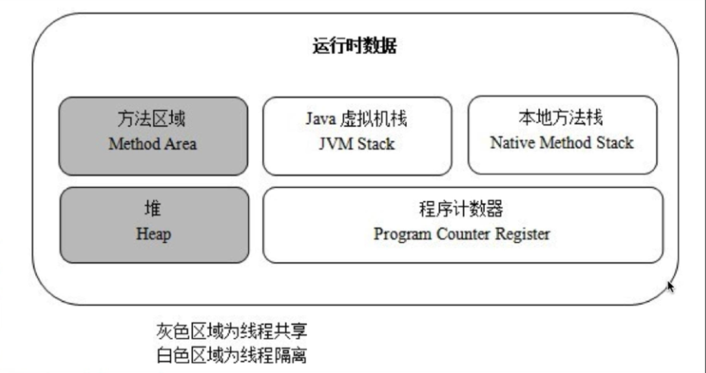

## Java运行时内存结构



- 概述
	```
	Java运行时内存结构主要分为5个部分: 虚拟机栈, 本地方法栈, 程序计数器(PC), 堆, 方法区
	其中前三者为线程独有的, 后两者是线程共享的, 对于每一个线程来说, 有可能执行的代码不同, 方法调用的
	逻辑不同, 所以需要不同的虚拟机栈, 本地方法栈, 程序计数器, 所以说这是线程独有的部分, 而堆用来存储
	对象, 方法区用来存储类的元信息, 对于这两个来说, 只要Java程序还在运行, 那么它们的信息可以让所有的
	线程共同访问, 举个例子, 当Object类被加载到内存后, 该类的元信息放在方法区中, 那么不同的线程可以共
	享这个元信息, 而不是说一个线程加载一份Object类, 也没有必要, 因为这些信息都是一样的
	```

- 虚拟机栈
	```
	虚拟机栈中存放的是一个个栈帧, 栈帧中保存了方法的局部变量表, 方法的返回地址, 动态链接信息以及操作
	数栈等, 一个方法的执行过程, 就是这个方法对于栈帧的入栈出栈过程, 比如当调用一个test方法, 那么就会
	将该方法的信息压入栈中, 方法的信息在字节码的层面上会表现在Code中
	```
- 本地方法栈
	```
	上面的虚拟机栈主要是用来处理Java代码生成的不同的栈帧, 而我们Java代码中会存在一些Native方法, 这些
	方法是由C++来编写的, 对于这些代码的产生的栈帧则由本地方法栈来进行处理
	```
- 程序计数器
	```
	表示当前执行的是第几个字节码指令, 下一个应该执行的是第几个字节码指令
	```	
- 堆
	```
	JVM管理的最大一块空间, 是GC的主要工作区域, 堆中放置的是我们创建的一个个对象, 对这些对象的管理是
	GC的工作, 所以后面说的垃圾回收算法, 以及一些新生代, 老年代这样的概念都会在这里出现, 假设我们在一
	个方法中创建了一个对象obj, Object obj = new Object(), 那么对于obj这个变量来说自然就是放在局部
	变量表中的, 而对于new出来的这个对象则放在堆中, 对于obj引向堆中的对象引用主要有两种方式:
		<1> 通过句柄的方式, obj指向堆中的一个位置(可以称为句柄), 在这个句柄中存放两个指针信息, 一个是
				真正new出来的这个对象在堆中的位置, 一个是指向方法区中对应的Object类的元信息的位置
		<2> 通过直接指针的方式, obj直接指向new出来的这个对象在堆中的位置, 同时在这个位置中还有一个引向
				方法区中对应的Object类的元信息位置的指针
	```
- 方法区
	```
	存储类的元信息, 对于这些信息来说, 在JDK1.8之前被称为永久代(表示几乎不会被垃圾回收机制回收的信息)
	而到了JDK1.8之后, 永久代被废除了, 并且被元空间(metaspace)取代, 同时方法区中还保存了运行时常量池
	与类文件中的常量池不同的是运行时常量池的数据是可以动态修改的, 而类文件中的常量池是存放在元空间对应
	的类元信息中的, 对于方法区来说, 其占据的内存不属于JVM管理, 叫做直接内存, 由操作系统管理
	```	


- 关于Java创建对象的三个步骤
  ```
	1. 在堆内存中创建对象的实例(字节码指令: new)
	2. 为对象的实例成员变量赋初值(字节码上可以看到执行了<init>方法)(字节码指令: invokespecial)
	3. 将对象的引用返回(字节码指令: astore_1)
	```
		

- 为对象在堆内存开辟空间的两种方式
	```
	指针碰撞(前提是堆中的空间通过一个指针进行分割, 一侧是已经被占用的空间, 另一侧是未被占用的空间)
	空闲列表(前提是堆内存空间中已被使用与未被使用的空间是交织在一起的, 这时虚拟机就要通过一个列表来记录
					哪些空间是可以使用的, 哪些空间是已经被使用的, 接下来找出可以容纳下新创建对象的且未被使用的
					空间, 在此空间存放该对象, 同时修改列表上内存的记录)
	```
	

- 对象在内存中的布局
	```
	1. 对象头(描述对象的一些信息, 比如对象对应的哈希码)
	2. 实例数据(即我们在一个类中所声明的各项信息)
	3. 对象填充(起到了占位符的作用, 假设一个对象需要占用1M, 那么当一个对象不够这么大的时候, 就利用
		 对象填充来填补空闲的位置)
	```


