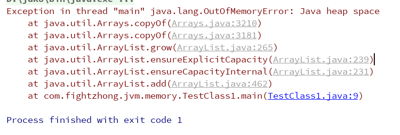
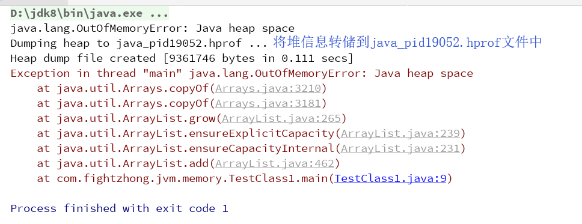
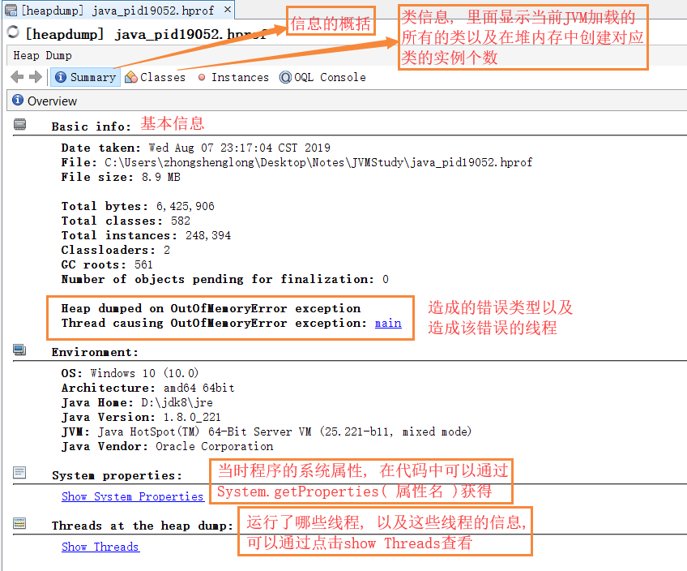
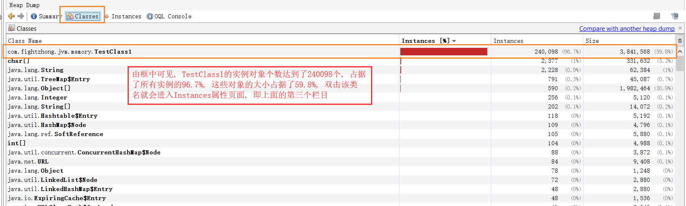
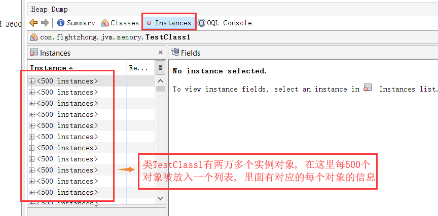
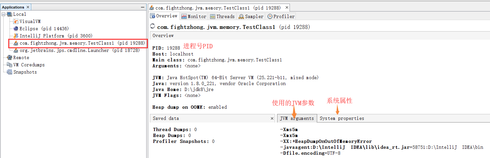
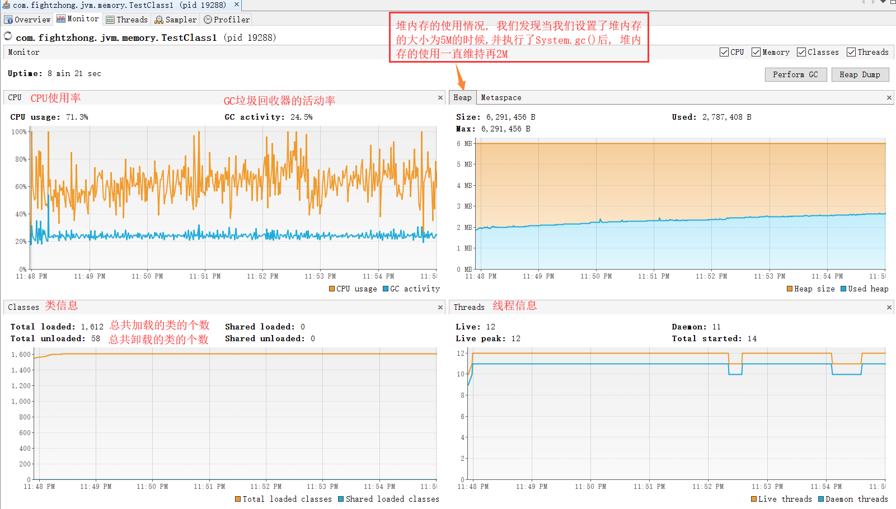
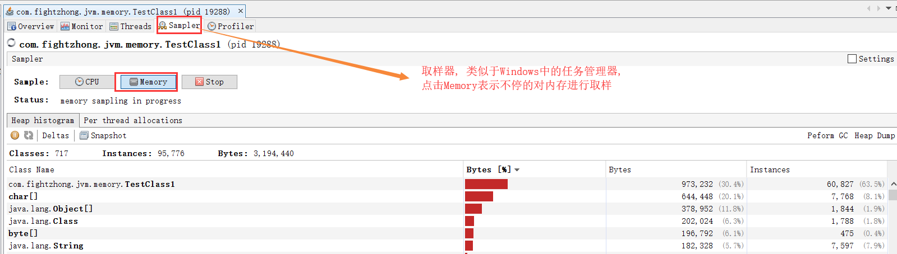

## 堆内存溢出案例分析( OutOfMemoryError )
- 源代码
	```java
	public class TestClass1 {
		public static void main (String[] args) {
			ArrayList<TestClass1> list = new ArrayList<>();
			while ( true ) {
				list.add( new TestClass1() );
			}
		}
	}
	```
- 分析
	```
	由代码可得, 通过一个死循环我们不停的往list中添加TestClass1类对象, 从而使得堆中的对象个数不停的
	增加, 从而会造成堆内存溢出错误, 如下图: 
	```

		

- JVM参数进一步测试堆内存溢出错误
	```
	为了能够更快的造成堆内存溢出, 并且将堆内存的溢出错误发生的现场环境保存下来, 我们可以添加三个JVM
	参数[ -Xms5m -Xmx5m -XX:+HeapDumpOnOutOfMemoryError ], 参数的含义是设置虚拟机堆内存的最小值
	为5M, 最大值为5M, 即不存在堆内存的变化, 固定为5M, 如下图所示: 
	```

		

- jvisualvm分析堆内存溢出错误输出的文件
	```
	通过添加一个[ -XX:+HeapDumpOnOutOfMemoryError ]参数, 在发生该错误的时候会将堆当时的信息输出为
	一个后缀名为.hprof的文件, 执行jvisualvm命令打开GUI, 然后选择文件, 选中打开以.hprof后缀名的文件,
	下面我们对该文件进行简要的分析
	```

	
	
	


## jvisualvm分析类TestClass1运行时的状态
- 修改源代码
	```java
	public class TestClass1 {
		public static void main (String[] args) {
			ArrayList<TestClass1> list = new ArrayList<>();
			while ( true ) {
				list.add( new TestClass1() );
				System.gc();
			}
		}
	}

	在上一个案例的基础上增加了一个System.gc()来主动让虚拟机执行垃圾回收, 我们发现增加了该代码后没有
	再出现堆内存溢出的错误, 程序处于一直运行状态, 此时我们通过jvisualvm来对该Java进程进行分析
	```

- 分析



