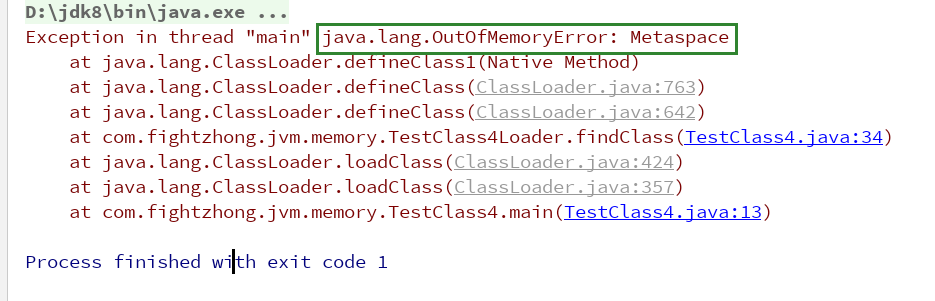

## 引入
```
方法区是用于存放一些元信息的, 如类Class信息, 以及一些运行时常量池, 类Class信息被存放在元空间中
(Metaspace), 由此可见, 当我们的类Class信息达到了一定程度后会导致元空间的内存溢出, 同时也是方法区
的内存溢出

元空间: 由JDK1.8才开始使用, 同时废弃了永久代, 元空间使用的是操作系统的直接内存, 并且由元空间虚拟机
       独立管理, 在一般情况下是不会发生内存溢出的, 当类加载的越来越多时, 元空间的大小也会动态的扩展,
       当达到了一个局限值后, 就会触发垃圾回收器来回收不再使用的Class对象, 一般元空间的大小默认为21M

为了能够造成元空间内存溢出, 我们需要设置一定的参数来固定元空间的大小, 即-XX:MaxMetaspaceSize=20m,
设置了20m的元空间的大小后, 接下来我们将不停的加载不同的类, 从而使得撑满元空间, 在这里我采用的是通过
自定义classloader的方式来加载类信息, 并且会用到命名空间, 如果对命名空间不熟悉的可以看下上面的关于类
加载器的相关文章, 在那里我对类的命名空间这个概念进行了详细的讲解与演示, 并且这个类加载器的代码我就
不贴出来了, 上面同样有一篇文章专门写了如何自定义类加载器

在往上有看到用CGlib方式实现的, 由于目前阶段我并没接触到这个(貌似是一个类似于动态代理一样可以动态
的在运行期生成类的东西), 所以我采用了自定义类加载器的方式来实现
```

- 测试代码
```java
class TestClass4_ {
}

public class TestClass4 {
	public static void main (String[] args) throws Exception {
		ArrayList<Class> classlist = new ArrayList<>();
		while ( true ) {
			TestClass4Loader loader = new TestClass4Loader( ClassLoader.getSystemClassLoader().getParent() );
			loader.setAddress( "C:/Users/zhongshenglong/Desktop/Notes/JVMStudy/target/classes/" );
			Class<?> c = loader.loadClass( "com.fightzhong.jvm.memory.TestClass4_" );
			classlist.add( c );
		}
	}
}
```

- 分析
```
注意: 上面的类加载器的代码是我临时写出来的, 可能跟上面的文章上的命名不一样, 但是实现是相同的
首先我创建了一个ArrayList, 目的是为了将下面创建的Class对象防止被垃圾回收器因为没有引用而导致回收,
从而使得Class对象的元信息能够长久的放置在元空间中, 然后我显示的设置了类加载器的加载路径为我项目的地
址, 即AppClassloader的加载路径, 这里需要注意的是, 由于命名空间的存在, 我创建的loader对象不是单例
的, 所以！！！在循环中创建的每一个类TestClass4_的Class对象都是不同的！！！, 从而使得元空间中存在
大量相同的Class对象, 这个接下来我会用图片给大家看清楚, 之后运行程序, 当运行了一会之后, 即报出了异
常
```




