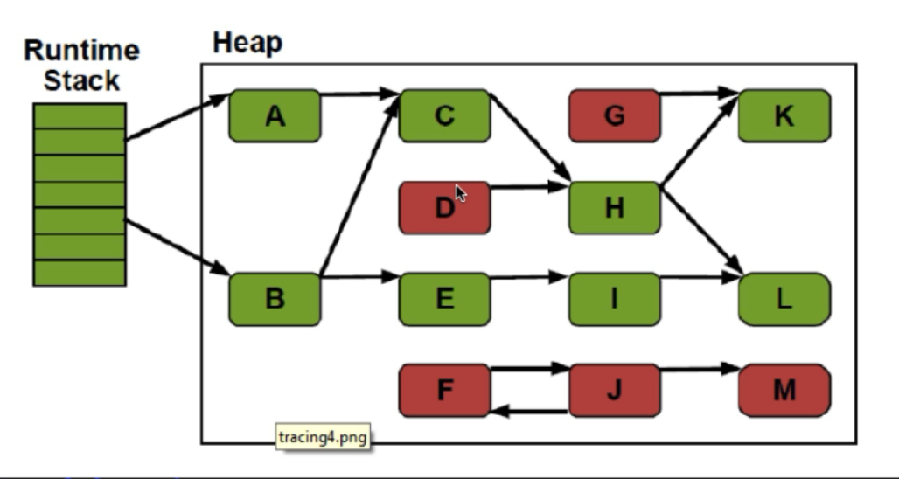

## 垃圾回收概念
> 对于垃圾回收方面的信息, 我将先对概念进行学习总结, 后面通过各种案例来验证这些概念

```
对于JVM垃圾回收来说, 主要由三部分组成: 垃圾判断算法(判断哪些是垃圾, 哪些不是垃圾), 垃圾回收算法(用
来对垃圾进行回收的机制), 垃圾回收器(对垃圾回收算法进行封装, 从而得到的一套垃圾回收机制)

垃圾回收算法仅仅只是对垃圾的回收, 在回收的前后可能还需要其它数据的支持, 所以垃圾回收器就是这两者的
结合, 也是真正执行垃圾回收机制的东西
```

## 垃圾判断算法
- 引用计数算法(Reference Counting)
  ```
  描述: 给对象添加一个引用计数器, 当有一个地方引用它, 计数器加1, 当引用失效, 计数器减1, 任何时刻
        计数器为0的对象就是不可能再被使用的, 缺点是无法解决对象循环引用的问题

  循环引用问题: 假设一个方法里有一个变量a指向一个对象obj1(引用数+1), 同时这个对象obj1里面有一个成
               员变量指向对象obj2(引用数+1), 并且这个对象obj2也有一个成员变量指向obj1(引用数+1),
               那么当执行这个方法的时候, 就会在栈中放入一个变量a, 指向堆中的obj1, 而一旦方法调用
               结束后, 处于栈中的局部变量就会被立马回收掉, 从而使得obj1的引用减1, 但是！此时由于
               obj1和obj2都有一个引用指向对方, 所以导致了obj1和obj2此时不能被垃圾回收器回收
  ```
- 根搜索算法(Root Tracing)
  ```
  在实际的生产语言中(Java、C#等), 都是使用根搜索算法判定对象是否存活

  算法的基本思路: 通过一系列的称为"GC Roots"的点作为起始向下搜索, 当一个对象到GC Roots没有任何引
                 用链(Reference Chain)相连, 则证明此对象是不可用的
  
  GC Roots: 
    - 在VM栈(栈中的本地变量)中引用
    - 方法区中的静态引用
    - JNI(即一般说的Native方法)中的引用

  例子: 如下图所示, 在Runtime Stack即虚拟机栈中有两个变量引向了堆中的对象, 这两个变量就叫GC Roots,
        当我们在判断是否存在垃圾对象的时候, 就会从这两个对象出发, 查找一条引用链, 如A -> C -> H
        -> K 或者A -> C -> H -> L, 对于这些对象来说, 由于存在一条到GC Roots的引用链, 所以对于这
        些对象被判定为非垃圾对象, 而对于D, G, F, J, M这些对象来说则被判断为垃圾对象, 接下来这些对
        象就会被垃圾回收算法给回收, 并且我们可以看到, 该方法解决了循环引用问题
  ```

  

## 垃圾回收(GC)算法
- 标记清除算法(Mark Sweep)
  ```
  描述: 算法分为"标记"和"清除"两个阶段, 首先标记出所有需要回收的对象, 然后回收所有的需要回收的对象
                
  缺点: 
    - 效率问题, 标记和清除两个过程效率都不高, 需要扫描所有对象, 堆越大, GC越慢
    - 空间问题, 标记清理之后会产生大量不连续的内存碎片, 空间碎片太多可能会导致后序使用中无法
      找到足够的连续内存而提前触发另一次的垃圾搜集动作
  
  例子: 如下图所示, 我们知道Java是通过GC Roots的方式来判断垃圾对象的, 所以经过判断后, 下图中红色
        标记的为垃圾对象, 其余的为非垃圾对象, 此时标记清除算法会执行以下两步, 标记所有的垃圾对象,
        清除所有的垃圾对象, 这两步是分开进行的
        
  ```

  

- 标记整理算法(Mark Compact)
  ```
  描述: 标记过程仍然一样, 但后续步骤不是进行直接清理, 而是令所有存活的对象一端移动, 然后直接清理掉
        这端边界以外的内存

  - 没有内存碎片
  - 比Mark-Sweep耗费更多的时间进行compact
  ```

- 复制算法(Copy) 
  ```
  现在的商业虚拟机中都是用了这一种收集算法来回收新生代

  基本描述: 将可用内存分为两块, 每次只使用其中的一块, 当半区内存用完了, 仅将还存活的对象复制到另
            一块上面, 然后就把原来整块内存空间一次性清理掉, 这样使得每次内存回收都是对整个半区的
            回收, 内存分配时也就不用考虑内存碎片等复杂情况, 只要移动堆顶指针, 按顺序分配内存就可
            以了, 实现简单, 运行高效
  
  算法在JVM中的具体使用: 将内存分为一块较大的eden空间和两块较小的survivor空间, 每次使用eden和其中
                       一块survivor, 当回收时将eden和survivor还存活的对象一次性拷贝到另外一块
                       survivor空间上, 然后清理掉eden和用过的survivor, Oracle Hotspot虚拟机默
                       认eden和survivor的大小比例是8:1, 也就是每次只有10%的内存是"浪费"的
  优缺点:
    <1> 代价是将内存缩小为原来的一半, 代价高昂
    <2> 在对象存活率高的适合, 效率会有所下降
    <3> 通过GC Roots方式只需要扫描存活的对象, 而不用扫描全部对象, 效率更高, 所以非常适合生命周期
        比较短的对象, 因为每次GC总能回收大部分对象, 复制的开销比较下
    <4> 不会产生碎片
    <5> 需要浪费额外的内存作为复制区

  例子: 如下图所示, 通过对GC Roots的链进行扫描, 将扫描到的对象放入下面的to-space区域, 然后清空整
        个from-space区域其实这个是新生代中复制算法实现的一部分, 在下面讲解分代算法的时候会对该复制
        算法在新生代的体现进行讲解
  ```

      

- 分代算法
  ```
  描述:
    当前商业虚拟机的垃圾手机都是采用"分代收集"(Generational Collection)算法, 根据对象不同的存活
    周期将内存划分为几块, 一般将Java堆分作新生代和老年代, 对不同的年代根据其特点采用最适当的收集算
    法,如新生代每次GC都有大量对象dead, 少量存活, 则可以选择复制算法对新生代的对象进行垃圾回收, 从
    而使得用低的复制成本即可完成收集
  新生代:
    新创建的对象在没有进行一定的配置下都是放在新生代中, 用复制算法进行GC, 新生代分为三个区域, Eden
    区域, 两个Survivor区域(可以通过参数设置Survivor个数), Survivor区域又分为from-space和to-space,
    对象均在Eden区域生成, 当Eden区域满的时候, 采用复制算法, 将仍然存活的对象放入from-space, 当
    from-space的空间满的时候, 就再一次执行复制算法, 将仍然存活的对象放入to-space, 当to-space满的
    时候, 再一次执行复制算法, 将仍然存活的对象放入老年代中, Eden区域和两个Survivor区域的比例一般
    是8:1:1, 也就是说只有10%的空间(to-space的空间)会被浪费, 可以根据GC log的信息调整大小的比例
  老年代:
    存放了经过了一次或多次GC还存活的对象, 一般采用Mark-Sweep或者Mark-Compact算法进行GC, 有多种垃
    圾收集器可以选择, 每种垃圾收集器可以看作一个GC算法的具体实现。可以根据不同场景选择不同的垃圾收
    集器(如吞吐量, 追求最短的响应时间)
  永久代
    并不属于堆(Heap), 但是GC也会涉及到这个区域存放了每个Class的结构信息, 包括常量池、字段描述、方
    法描述, 与垃圾收集器收集的Java对象关系不大    
  ```


## 垃圾回收器       
- 基本概念
  ```
  垃圾回收器是GC的具体实现, HotSpot JVM提供多种垃圾回收器, 我们需要根据需求采用不同的回收器, 没有万
  能的垃圾回收器, 每种垃圾回收器都有自己的使用场景

  并行(Parallel): 指多个收集器的线程同时工作, 但是用户线程处于等待状态
  并发(Concurrent): 指收集器在工作的同时, 可以允许用户线程工作, 并发并不代表解决了GC停顿的问题, 在
                    关键的步骤还是要停顿, 比如垃圾收集器标记垃圾的时候, 但在清除垃圾的时候, 用户线
                    程可以和GC线程并发执行
  ```

- Serial收集器
  ```
  单线程收集器, 收集时会暂停所有工作线程(Stop The World STW), 使用复制收集算法, 虚拟机运行在Client
  模式时的默认新生代收集器, New和Old Generation都可以使用, 在新生代, 采用复制算法, 在老年代, 采用
  Mark-Compact算法, 因为是单线程GC, 没有多线程切换的额外开销, 简单实用
  ```

- Serial Old收集器
  ```
  Serial Old是单线程收集器, 使用标记-整理算法, 是老年代的收集器  
  ```

- ParNew收集器
  ```
  ParNew收集器就是Serial的多线程版本, 除了使用多个收集线程外, 其余行为包括算法、STW、对象分配原则,
  回收策略等都与Serial收集器一模一样,是虚拟机运行在Server模式的默认新生代收集器, 在单CPU的环境中,
  ParNew收集器并不会比Serial收集器有更好的效果, Serial收集器在新生代的多线程版本, 使用复制算法
  (因为针对新生代), 可以通过-XX:ParallelGCThreads来控制GC线程数的多少, 需要结合具体CPU的个数
  ```


- CMS(Concurrent Mark Sweep)收集器
  ```
  CMS是一种以最短停顿时间为目标的收集器, 使用CMS并不能达到GC效率最高(总体GC时间最小), 但它能尽可能
  降低GC时服务的停顿时间, CMS收集器使用的是标记-清除算法, 追求最短停顿时间, 非常适合Web应用, 只针
  对老年区, 一般结合ParNew使用, Concurrent, GC线程和用户线程并发工作(尽量并发), 使用
  -XX:+UseConcMarkSweepGC打开, 在并发清理的过程中, 用户线程还在跑, 这时候需要预留一部分空间给用
  户线程, 会带来碎片问题, 碎片过多会容易频繁触发Full GC
  ```

- Parallel Scavenge收集器
  ```
  Parallel Scavenge收集器也是一个多线程收集器, 也是使用复制算法, 但它的对象分配规则与回收策略都与
  ParNew收集器有所不同, 它是以吞吐量最大化(即GC时间占总运行时间最小)为目标的收集器实现, 它允许较长
  时间的STW换取总吞吐量最大化
  ```

- Parallel Old收集器
  ```
  老年代版本吞吐量优先收集器, 使用多线程和标记-整理算法, JVM1.6提供 , 在此之前, 新生代使用了PS收
  集器的话, 老年代除Serial Old外别无选择, 因为PS无法与CMS收集器配合工作, Parallel Scavenge在老
  年代的实现, Parallel Scavenge + Parallel Old = 高吞吐量, 但GC停顿可能不理想
  ```

## 内存分配
```
堆上分配: 大多数情况在eden上分配, 偶尔会直接在old上分配, 细节取决于GC的实现
栈上分配: 原子类型的局部变量
```

## 内存回收
```
GC要做的是将哪些dead的对象所占用的内存回收掉
- 没有引用的对象是dead的
  - 引用分为四种: Strong, Soft, Weak, Phantom
    - Strong即默认通过Object o = new Object()这种方式赋值的引用
    - Soft, Weak, Phantom这三种则是继承Reference
  - 在Full GC时会对Reference 类型的引用进行特殊处理
    - Soft: 内存不够时一定会被GC、长期不用时也会被GC
    - Weak: 一定会被GC, 当被mark为dead, 会在ReferenceQueue中通知
    - Phantom: 本来就没引用, 当从jvm heap中释放时会通知
```

## GC的时机
```
- 在分代模型的基础上, GC从时机上分为两种: Scavenge GC和Full GC
- Scavenge GC(Minor GC):
  - 触发时机: 新对象生成, Eden空间满了
  - 理论上Eden区大多数对象会在Scavenge GC回收, 复制算法的执行效率会很高, Scavenge GC时间比较短
- Full GC:
  - 会对整个JVM进行整理, 包括Young、Old和Perm
  - 主要的触发时机: <1> Old满了 <2> Perm满了 <3> system.gc()
  - 效率很低, 尽量减少Full GC
```

## 方法区
```
- Java虚拟机规范表示可以不要求虚拟机在这区实现GC, 这区GC的"性价比"一般比较低
- 在堆中, 尤其是在新生代, 常规应用进行依次GC一般可以回收70%-95%的空间, 而方法区的GC效率远小于此
- 当前的商业JVM都有实现方法区的GC, 主要回收两部分内存: 废弃常量与无用类
- 在大量使用反射、动态代理、CGLib等字节码框架、动态生成JSP以及OSGi这类频繁自定义ClassLoader的
  场景都需要JVM具备类卸载的支持以保证方法区不会溢出

方法区类回收需要满足三个条件:
  - 该类所有的实例都已经被GC, 也就是JVM中不存在该Class的任何实例 
  - 加载该类的ClassLoader已经被GC
  - 该类对应的java.lang.Class对象没有在任何地方被引用, 如不能在任何地方通过反射访问该类的方法
```