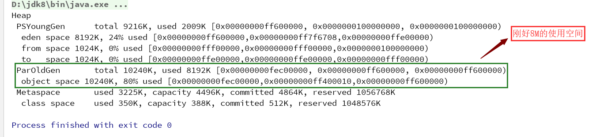

## 垃圾回收日志分析
- JVM参数
```
-verbose:gc             输出GC的所有信息
-Xms20m                 设置堆的最小为20m
-Xmx20m                 设置堆的最大为20m
-Xmn10m                 设置堆中新生代为10m
-XX:+PrintGCDetails     开启打印GC详细信息到控制台的功能
-XX:SurvivorRatio=8     设置新生代中eden空间和survivor空间的比例是8:1:1

分析: 由以上JVM参数可得, 我们设置了堆的大小为20m, 新生代的大小为10m, 新生代中eden空间为8m, 两个
      survivor空间均为1m, 除去新生代后便是老年代, 所以老年代的空间为10m
```

- 代码一(无GC)
```java
public class TestClass1 {
	public static void main (String[] args) {}
}

分析: 我们定义了一个TestClass1类, 并在里面定义了一个main方法, 然后执行main方法, 此时查看输出如下
      图所示
```


- 代码二(MinorGC)
```java
public class TestClass1 {
	public static void main (String[] args) {
		int size = 1024 * 1024;
		byte[] arr1 = new byte[2 * size];
		byte[] arr2 = new byte[2 * size];
		byte[] arr3 = new byte[3 * size];

	}
}

分析: 设置大小size为1024*1024, 那么当我们创建字节数组并且为size大小的时候, 则该字节数组的大小为
      1M, 根据代码可得, 我们创建了7M大小的即7168K大小的字节数组, 同时会在堆内存中占据7168K, 加上
      之前的分析可得, 虚拟机默认会使用2009K, 所以7168+2009=9177已经大于了eden空间8192K的大小,
      此时会执行垃圾回收, 如下图所示: 

      补充: PSYoungGen: Parallel Scavenge (新生代垃圾收集器)
            ParOldGen: Parallel Old (老年代垃圾收集器)
```


- 代码三(FullGC)
```java
public class TestClass1 {
	public static void main (String[] args) {
		int size = 1024 * 1024;
		byte[] arr1 = new byte[2 * size];
		byte[] arr2 = new byte[3 * size];
		byte[] arr3 = new byte[3 * size];

	}
}

分析: 在上一个代码的情况下将arr2的大小设置为3M, 此时会触发Full GC, 我们先不用去考虑为什么会触发该
      GC, 下面的分析只是对Full GC日志的讲解
```


- 代码四(验证JVM中新生代容纳不下新创建的对象时, 新创建的对象将会直接在老年代中诞生)
```java
public class TestClass2 {
	public static void main (String[] args) {
		int size = 1024 * 1024;
		byte[] arr1 = new byte[8 * size];
	}
}

分析: 参数仍然是之前那几个, 也就是说新生代中Eden空间为8M, 两个Survivor空间均为1M, 总的来说新生代
     中可用空间是9M, 此时我们创建的是8M的数组对象, 新生代是不能存放下如此大的对象的, 所以会直接晋
     升到老年代, 如下图所示
```



