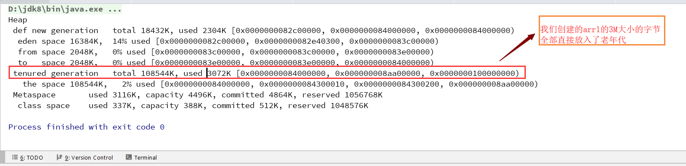

## 引入
```
我们知道一个新创建的对象的大小如果小于新生代中对象的大小的话, 则会在eden空间中诞生, 而如果大于新生
代大小的话, 则会直接晋升到老年代, 那么如何才能使得一个对象直接在老年代中诞生, 并且其大小又小于新生
代的大小呢, 这里需要用到-XX:PretenureSizeThreshold参数

-XX:PretenureSizeThreshold=xxx: 当我们创建的对象的大小超过了阈值xxx字节, 则这个对象会直接在老年
                                代创建, 必须在串行的GC下才能生效, 并且必须显示的指定-Xms, -Xmx,
                                -Xmn三者之一的值, 即堆空间, 新生代空间大小
-XX:+UseSerialGC: 使用串行垃圾收集器
```

- 代码
```java
public class TestClass5 {
  public static void main (String[] args) {
    int size = 1024 * 1024;
    byte[] arr1 = new byte[size * 3];
  }
}
```

- JVM参数
```
-verbose:gc
-XX:+UseSerialGC
-XX:+PrintGCDetails
-XX:PretenureSizeThreshold=2097152
-Xms20m
```

- 结果分析




