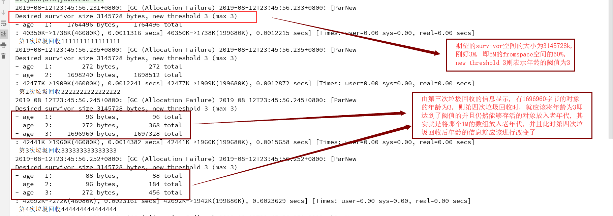
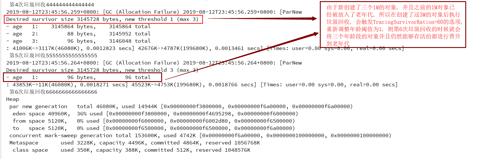

## 引入
```
对象在新生代中每经历一次垃圾回收, 其年龄就加一, 当年龄达到了一个阈值之后, 下一次垃圾回收就会将该对
象晋升到老年代, 通过-XX:MaxTenuringThreshold=3可以显示的设置对象的年龄阈值的最大值是3, JVM会通过
一块survivor空间(fromspace)的大小对这个年龄阈值进行调整, 但是最大不超过3, 从而可以在survivor空间
使用达到一定的情况下, 使得仍然存活的对象提前晋升到老年代, 这样就可以空出空间, 防止新生代eden可用空
间过小, 从而防止新创建的对象大于eden可用空间的大小, 进而该对象直接在老年代中创建
```

## JVM参数
```
-verbose:gc
-Xms200m
-Xmx200m
  通过上面两个参数设置堆空间的值为200m
-Xmn50m
  设置新生代空间的大小为50m
-XX:TargetSurvivorRatio=60
  设置当survivor空间(from-space)使用率达到60%的时候就重新调整年龄阈值, 使得该空间内仍然存活的对象
  尽快进入老年代, 根据默认新生代默认比例为8:1:1得出, from-space为5m, 则60%为3m, 则当from-space
  空间使用率达到3m时就会重新计算年龄阈值
-XX:+PrintTenuringDistribution: 打印在survivor空间中对象的年龄情况
-XX:+PrintGCDetails
-XX:+PrintGCDateStamps: 执行GC的时间戳, 即当前时间
-XX:+UseConcMarkSweepGC: 老年代垃圾收集器CMS
-XX:+UseParNewGC: 新生代垃圾收集器
-XX:MaxTenuringThreshold=3: 设置最大的年龄阈值为3, 即JVM调整年龄阈值时不会超过3
```

## 测试代码
```java
public class TestClass6 {
  public static void main (String[] args) throws InterruptedException {
    byte[] arr1 = new byte[1024 * 1024];

    test();
    Thread.sleep(1000);
    System.out.println(" 第1次垃圾回收1111111111111111 ");

    test();
    Thread.sleep(1000);
    System.out.println(" 第2次垃圾回收2222222222222222 ");

    test();
    Thread.sleep(1000);
    System.out.println(" 第3次垃圾回收333333333333333 ");

    test();
    Thread.sleep(1000);
    System.out.println(" 第4次垃圾回收444444444444444 ");

    byte[] arr3 = new byte[1024 * 1024];
    byte[] arr4 = new byte[1024 * 1024];
    byte[] arr5 = new byte[1024 * 1024];


    test();
    Thread.sleep(1000);
    System.out.println(" 第5次垃圾回收5555555555555555 ");


    test();
    Thread.sleep(1000);
    System.out.println(" 第6次垃圾回收6666666666666666 ");

  }

  public static void test () {
    for ( int i = 0; i < 40; i ++ ) {
      byte[] arr = new byte[1024 * 1024];
    }
  }
}

分析: 
  <1> test函数中不停的创建对象, 是为了能够触发垃圾回收, 根据上面的计算, eden空间为45m, fromspace
      和tospace均为5m, 在我的计算机中, 创建40个1m的对象能够触发垃圾回收了, 至于让线程sleep的原因
      是为了能够有一定时间进行停顿
  <2> 初始的时候创建了1M大小的数组, 对于这个数组来说, 在main函数执行完之前都是会存在于堆中的, 然后
      我们一共进行了四次test方法的调用, 其实就是为了能够触发四次的GC, 从而使得这个数组对象的年龄
      从1加到3之后, 第四次的垃圾回收会将年龄为3的这个数组对象放入老年代
  <3> 然后我们创建了三个1M的数组, 这里需要注意的是, 此时eden空间会有3M的对象是一定不会被垃圾回收机
      制回收掉的, 所以当我们调用test方法时, 执行一次垃圾回收, 那么这3M的数组就会被放入fromspace,
      这时候触发了TargetSurvivorRatio=60的选项, 即3M刚好是5M的survivor空间的60%
  <4> 此时会触发JVM调整年龄阈值, 可以从下面的图片分析看到, 阈值被调整到了1
  <5> 再一次执行test, 又一次执行垃圾回收, 此时垃圾回收器会对survivor空间中年龄为1以上及1的所有对象
      进行晋升, 放入老年代     
```





