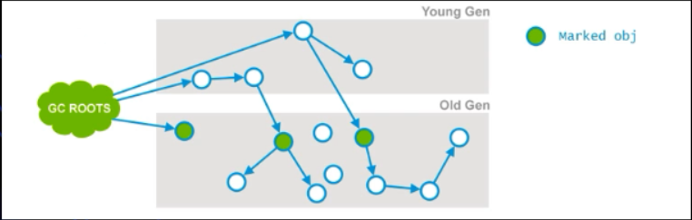
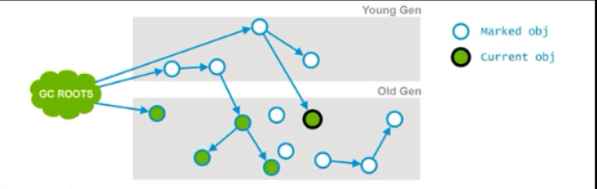
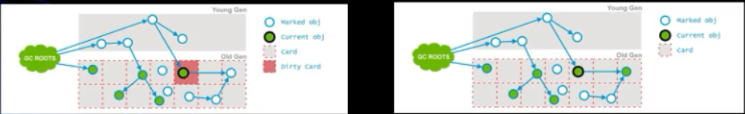
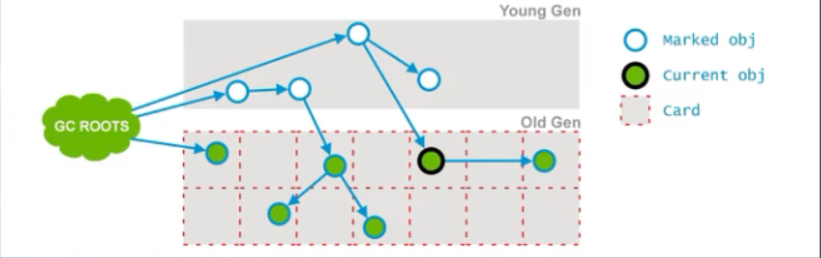
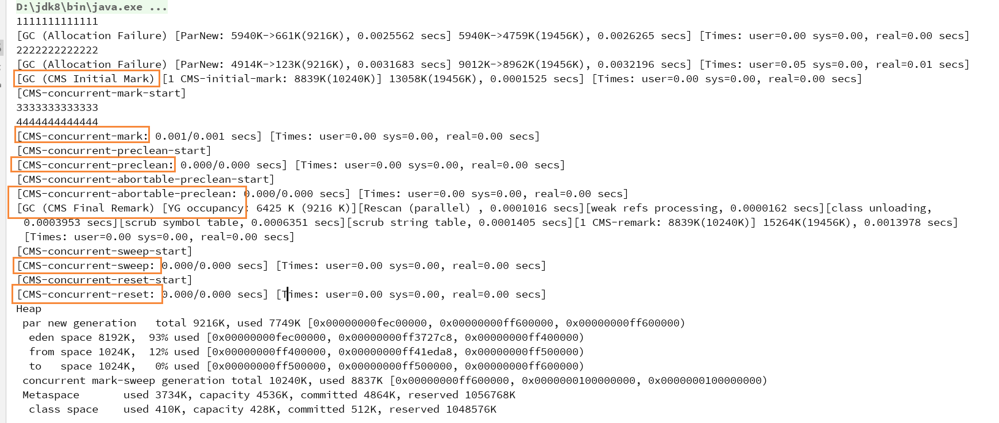

## CMS(Concurrent Mark Sweep)
## 概述
```
以获取最短回收停顿时间为目标, 垃圾收集的线程和用户线程可以同时执行, 基于"标记-清除"算法实现, CMS收
集器在整个过程中耗时最长的并发标记和并发清除过程收集器线程都可以与用户线程一起工作, 因此从总体上看,
CMS收集器的内存回收过程是与用户线程一起并发执行的
```

## 优点: 并发收集、低停顿

## 缺点
```
<1> 对CPU资源非常敏感
<2> 无法处理浮动垃圾(Floating Garbage), 浮动垃圾指的是一些对象当前可能是存在引用的, 而在并发标记
    的过程中失去了引用, 但是该对象在垃圾回收器看来仍然是存活的, 即本次垃圾回收不会回收这些对象, 只
    能等下一次垃圾回收了, 可能出现"Concurrent Mode Failure"失败(判定为老年代空间不足)而导致另一
    次Full GC的产生。如果在应用中老年代增长不是太快, 可以适当调高一个JVM参数的值来提高触发百分比
    (-XX:+CMSInitiatingOccupancyFraction), 值越高则触发CMS垃圾收集器GC的频率就越低, 以便降低内
    存回收次数从而获取更好的性能。要是CMS运行期间预留的内存无法满足程序需要时, 虚拟机将启动后备预
    案, 即启用Serial Old收集器来重新进行老年代的垃圾收集, 这样停顿时间就很长了, 所以说该JVM参数设
    置得太高很容易导致大量"Concurrent Mode Failure"失败, 性能反而降低
<3> 收集结束时会有大量空间碎片产生, 空间碎片过多时, 将会给大对象分配带来很大麻烦, 往往出现老年代还
    有很大空间剩余, 但是无法找到足够大的连续空间来分配当前对象, 不得不提前进行一次Full GC。CMS收集
    器提供了一个-XX:+UseCMSCompactAtFullCollection开关参数(默认开启), 用于在CMS收集器顶不住要进
    行Full GC时开启内存碎片的合并整理过程,内存整理过程是无法并发的, 空间碎片问题没有了, 但停顿时间
    不得不变长
```
  
## 空间分配担保
```
在发生Minor GC之前, 虚拟机会先检查老年代最大可用的连续空间是否大于新生代所有对象总空间, 如果这个条
件成立, 那么Minor GC可以确保安全的, 当大量对象在Minore GC后仍然存活, 就需要老年代进行空间分配担保,
把Survivor无法容纳的对象直接进入老年代。如果老年代判断到剩余空间不足(根据以往每一次回收晋升到老年代
对象容量的平均值作为经验值), 则进行一次Full GC 
```

## CMS收集器七个阶段
- Initial Mark(初始标记)
  ```
  CMS两次STW事件的其中一次, 这个阶段的目标是标记哪些直接被GC Root引用或者被年轻代存活对象所引用的所
  有对象, 如下图所示, 绿色的即为被初始标记阶段标记的对象, 一个是直接与GC Root相连的, 两个是由年轻代
  对象引用的
  ```


  
- Concurrent Mark(并发标记)
  ```
  这个阶段GC会遍历老年代, 然后标记所有存活的对象, 根据上个阶段GC Roots遍历查找到的去遍历老年代, 并发
  标记阶段的线程会与用户线程并发运行, 并不是老年代所有的存活对象都会被标记, 因为在标记期间用户线程可
  能会改变一些引用, 也就是说并发标记阶段其实就是GC Root Tracing的过程, 如下图所示, 根据Initial Mark
  阶段获取的三个对象引用开始Tracing, 找到了两个标记对象, 并且我们对比第一张图可以看到, 有一个对象已
  经失去了引用了
  ```


  
- Concurrent Preclean(并发预清理)
  ```
  这是一个并发阶段, 与用户线程并发运行, 并不会出现STW的情况, 在并发的过程中, 一些对象的引用可能会发生
  变化, 但是这种情况发生时, JVM会将包含这个对象的区域(Card)标记为Dirty, 即Card Marking, 在该阶段,
  那些能够从Dirty对象到达的对象也会被标记, 这个标记做完之后, dirty card标记就会被清除了, 该阶段开始
  后, 其会将引用发生改变的对象进行标记, 如下图所示, 粉红色标记的那个对象其引用指向了一个右边的对象,
  则粉红色区域的那个对象被标记为dirty, 然后根据dirty去Tracing, 找到所有被dirty对象引用链引用的对象
  即右边那个对象, 对该对象进行标记, 最后清除dirty card标记
  ```
 


- Concurrent Abortable Preclean(并发可能失败的预清理)
  ```
  这也是一个并发阶段, 同样与用户线程并发运行, 这个阶段是为了尽量承担STW中最终标记阶段的工作, 即在标记
  清除算法中, 标记阶段是会STW的, 而该阶段是为了尽量承担这个STW所作的工作又不会造成STW, 该阶段持续时
  间依赖于很多的因素, 由于该阶段是在重复做很多相同的工作, 直接满足一些条件(如重复迭代的次数、完成的工
  作量或者时钟时间等)
  ```

- Final Remark(重新标记)
  ```
  这是第二个STW的阶段, 该阶段的目标是标记老年代所有的存活对象, 由于之前的阶段是并发指向的, 所以用户
  线程可能会对一些对象的引用进行了修改, 而GC线程却没有跟上这个修改, 为了最终完成标记老年代中所有的存活
  对象, STW就非常重要了

  通常CMS的重新标记阶段会在年轻代尽可能干净的时候运行, 因为年轻代存活对象过多, 可能也会导致老年代中涉
  及的存活对象更多, 从而使得STW的时间即标记时间更长
  ```

> 经历了上述五个阶段, 老年代所有存活的对象都被标记了, 现在可以通过清除算法来清理那些在老年代不再使用的对象

- Concurrent Sweep(并发清除)
  ```
  清除老年代中的垃圾对象, 与用户进程并发执行
  ```



  - Concurrent Reset(并发重置)
  ```
  重新设置CMS内部数据结构, 为下一次GC做准备
  ```

## 实例
- 代码
  ```java
  public class TestClass8 {
    public static void main (String[] args) {
      int size = 1024 * 1024;
      byte[] arr1 = new byte[4 * size];
      System.out.println( "1111111111111" );

      byte[] arr2 = new byte[4 * size];
      System.out.println( "2222222222222" );

      byte[] arr3 = new byte[4 * size];
      System.out.println( "3333333333333" );

      byte[] arr4 = new byte[2 * size];
      System.out.println( "4444444444444" );
    }
  }
  ```
- JVM参数
  ```
  -verbose:gc
  -Xms20m
  -Xmx20m
  -Xmn10m
  -XX:+PrintGCDetails
  -XX:SurvivorRatio=8
  -XX:+UseConcMarkSweepGC(则默认使用CMS+ParNew)
  ```  
- 日志显示
```
可以通过下面的图片看到, 对于CMS垃圾回收器来说, 其垃圾回收是执行了七个阶段的
```  


