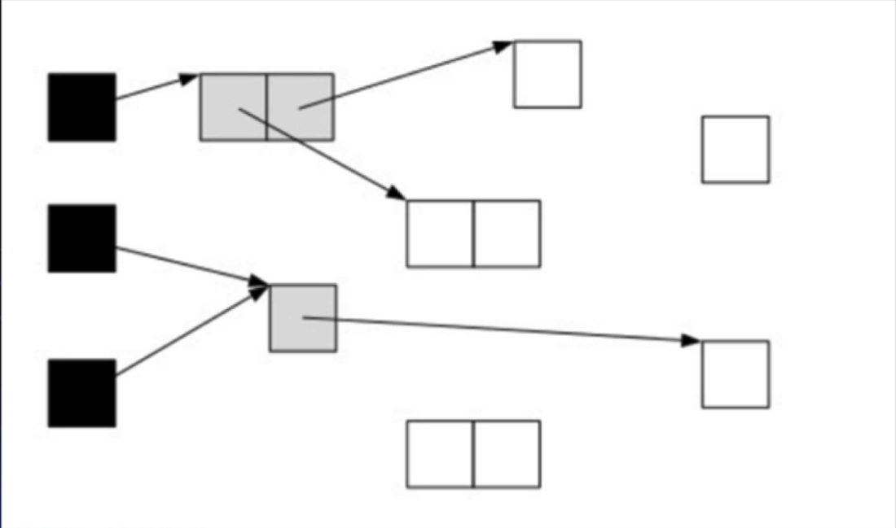
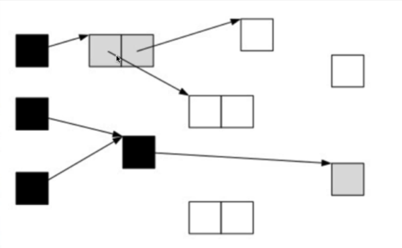
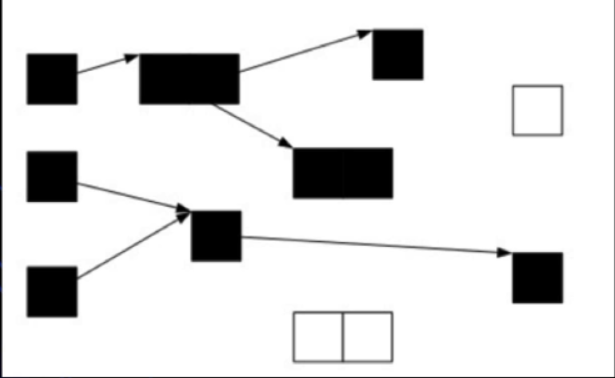
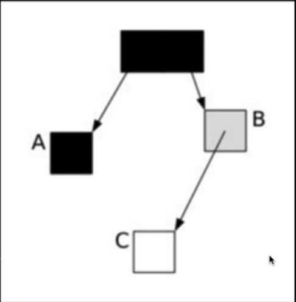
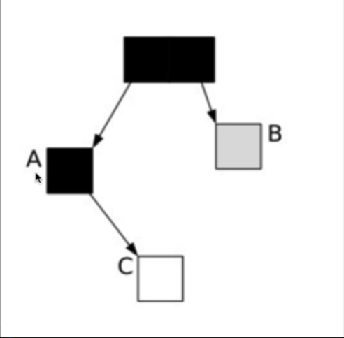

## 三色标记算法描述
```
描述: 并发标记的三色标记算法, 是描述追踪式回收器的一种有效的方法, 利用它可以推演回收器的正确性, 将
			对象分为三种类型
<1> 黑色: 根对象, 或者该对象与它的子对象都被扫描过(对象被标记了, 且它的所有field也被标记完了)
<2> 灰色: 对象本身被扫描, 但还没扫描完该对象中的子对象(它的field还没有被标记或标记完)
<3> 白色: 未被扫描对象, 扫描完成所有对象之后, 最终为白色的就是不可达对象, 即垃圾对象(对象没有被标记到)

举个例子:
	<1> 如下图一所示, 现状是黑色的对象为根对象, 子对象被置为了灰色, 子对象的子对象是白色的
	<2> 在开始的时候, 所有对象都是白色的, 开始从根对象查找, 此时根对象被扫描应该被置为灰色, 即仅仅扫
			描了其本身, 而没有扫描其子对象(如私有成员变量指向的一个其它对象), 之后扫描其子对象, 则其子对
			象此时被置为灰色, 而此时根对象应该被置为黑色(因为其和其子对象都已经被扫描了), 即图一的状态
	<3> 继续由上面置为灰色的对象遍历, 则灰色对象的子对象就会被置为灰色, 而灰色对象则置为黑色对象, 如
			图二所示, 一个灰色对象被置为了黑色, 一个白色对象置为了灰色
	<4> 遍历了所有可达的对象之后, 所有可达的对象都变成了黑色,而不可达对象则为白色, 需要被清理, 如图3    
```





## 三色标记算法在并发标记时的漏标问题
```
如果在标记过程中, 用户程序此时也在运行, 那么对象的指针就有可能改变, 这样就会导致对象丢失问题, 即漏
标问题, 如下图一所示, 在标记的一个阶段中, C对象还没被访问到, 则此时B对象已经被访问了, 则B置为灰色,
而A对象没有子对象, 所以其在标记到后就为黑色了, 如果此时进行了引用的改变, 如: A.c = B.c; B.c=null,
则对象的引用就变成了图二所示, 此时因为A已经是黑色了, 所以表示A及其子对象已经被标记过了, 那么C对象就
会被漏标, 从而被判定为是垃圾对象(然而本身并不是垃圾对象)
```





## SATB(snapshot-at-the-beginning)描述
```
SATB指的是在开始阶段生成一个快照图
<1> 在开始标记的时候生成一个快照图, 标记存活对象, 此时快照图中活得对象就认为是活的, 也就是说在之
		后的阶段中, 即使这些对象被取消了所有引用, 即成为了垃圾对象, 但是仍然被认为是存活对象
<2> 然后此时的并发标记阶段通过三色算法来进行标记, 此时会遇到两个问题, 一个是浮动垃圾, 这个倒是影响
		不大, 因为可以通过下一次的GC来进行回收, 另一个是漏标问题, 即不应该是垃圾对象的对象被当成了垃圾
		对象, 漏标问题非常严重, 必须不能出现, 否则会出现程序的错误
```

## 两个漏标问题
```
并发标记采用三色标记算法
问题一: 在并发标记的时候, 黑色对象即表示该对象及其子对象都被标记完了, 那么之后如果在该黑色对象又引
				用了一个新的对象(默认是white), 那么这个新的对象就会被漏标
问题二: 当一个未被访问并标记的对象(white对象)被取消了引用时, 如多个gray对象本来是引用了该white对象,
				之后对该white对象取消了引用, 而该white对象被一个黑色对象引用时, 那么这个white对象就会被
				漏标

总的来说, 就两个问题, 黑色对象引用了一个白色对象, 一个是white对象本身被gray引用, 而在之后却被所有
gray对象取消了引用

具体的例子:
	- 对black新引用一个white对象, 然后又从gray对象删除了对该white对象的引用, 造成white对象漏标
	- 对black新引用了一个white对象, 然后从gray对象删除了引用该white对象的white对象, 这样也会造成了
		该white对象漏标
	- 对black新引用了一个刚new出来的white对象, 没有其它gray对象引用该white对象, 造成新创建的对象漏标
```

## 解决漏标问题
```
<1> 对于新的引用产生在黑色对象中的问题, 利用post-write barrier, 即记录所有新增的引用关系, 然后根
		据这些引用关系为根重新扫描一遍, 如记录哪些黑色对象新增了引用, 然后以这些黑色对象为根进行重新扫描
<2> 对于gray对象删除了对白色对象的引用, 利用pre-write barrier, 将所有机将被删除的引用关系的旧引用
		记录下来(即灰色对象被记录下来), 最后以这些旧引用为根重新扫描
```


